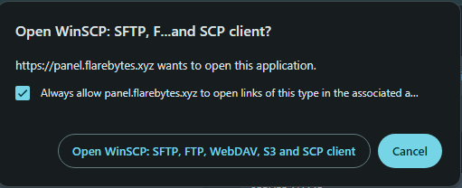
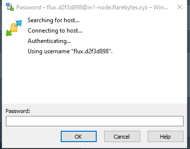

SFTP (Secure File Transfer Protocol) is an essential tool for managing files on your server. It allows you to easily transfer large, unzipped files between your computer and server. While this guide focuses on the **WinSCP** client, you can use other SFTP clients if preferred.

---

## Connecting to Your Server with WinSCP

1. **Download WinSCP**  
   - If you haven’t already, download WinSCP from the official website:  
     [Download WinSCP](https://winscp.net/eng/download.php)

2. **Navigate to the SFTP Settings in Your Panel**  
   - After downloading WinSCP, log into your server's control panel.
   - Go to the **Settings** page, and find the **SFTP Details** section.

3. **Launch SFTP Connection**  
   - Click on the **Launch SFTP** button to open the connection window.
   - A pop-up will appear asking you to **always allow** the connection from `Panel.flareBytes.xyz`. Tick the box to confirm.

4. **Open WinSCP**  
   - Click on the **Open WinSCP** button, and it will open the WinSCP client.

   

5. **Provide Your Account Password**  
   - When WinSCP opens, it will ask for a password. Enter the **account password** provided in the control panel.

   

6. **Access Your Server Files**  
   - After entering the password, click **OK**, and WinSCP will connect to your server and display your server's files.

---

## Uploading Files to Your Server

1. **Open Your Files Locally**  
   - Open the files you want to upload in a separate file explorer window.

2. **Drag and Drop Files**  
   - Simply drag and drop the files from your local file explorer to the **server files section** in WinSCP.  
   - The transfer should begin immediately.

3. **Confirm File Upload**  
   - Once the upload is complete, you should be able to see the uploaded files in the server panel.

---

## Tips for Successful File Transfers

- **Large Files**: For large file transfers, ensure your internet connection is stable to avoid interruptions.

---

Congratulations! You've successfully connected to your server via SFTP and uploaded files. This tool will make transferring large files to your server much easier and more efficient.

---
