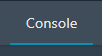
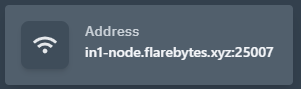

Typically, when you receive your account, the server is already installed and ready to use for your game or project. To connect to your server, use the address provided in the **Server Console** section.

  

Your server will have its own unique address. Use this to join your game server. If you find it difficult to connect, seek support in our **Discord** or check the **Pterodactyl Eggs GitHub** for the appropriate egg for your game.

---

## Connecting to Minecraft

Once you have configured your Minecraft server to your liking, follow these steps to connect and play:

### Steps for Cracked Players
1. Open the `server.properties` file.
2. Locate the `online-mode` line (typically line 48).
3. Set it to one of the following options:
   - `online-mode=false` — Cracked players **can** join.
   - `online-mode=true` — Cracked players **cannot** join.

### General Steps to Join Your Server
1. Start the server.
2. Open Minecraft and click the **Multiplayer** button.
3. Click **Add Server**.
4. Under **Server Name**, enter any name you like.
5. Under **Address**, paste the server address provided in the console section.
6. Click **Done**.
7. Your server will now appear in your **Multiplayer Server List**.

Congratulations! You have successfully configured and added your server to Minecraft. Click **Play** and enjoy.

---

## Changing Game Versions

At times, you may need to change your server's game version. Follow these steps to update it:

1. Open your **Server Console**.
2. Navigate to the **Startup** section in the top navigation bar.
3. In the **Variables** section, you will find the following options:
   - **Minecraft Version** — The version of Minecraft to download. Leave it as `latest` to always use the latest version. Invalid versions will default to the latest.
   - **Server Jar File** — The name of the server jar file used to run the server.
   - **Build Number** — The build number for the Paper release. Leave it as `latest` to always use the latest build. Invalid versions will default to the latest.

4. Adjust these settings as needed.
5. Save the changes.
6. Navigate to the **Settings** section in the top navigation bar.
7. Click the **Reinstall Server** button.

> **Note:** Reinstalling your server will stop it and re-run the installation script. Some files may be deleted or modified during this process. Please back up your data before proceeding.

---